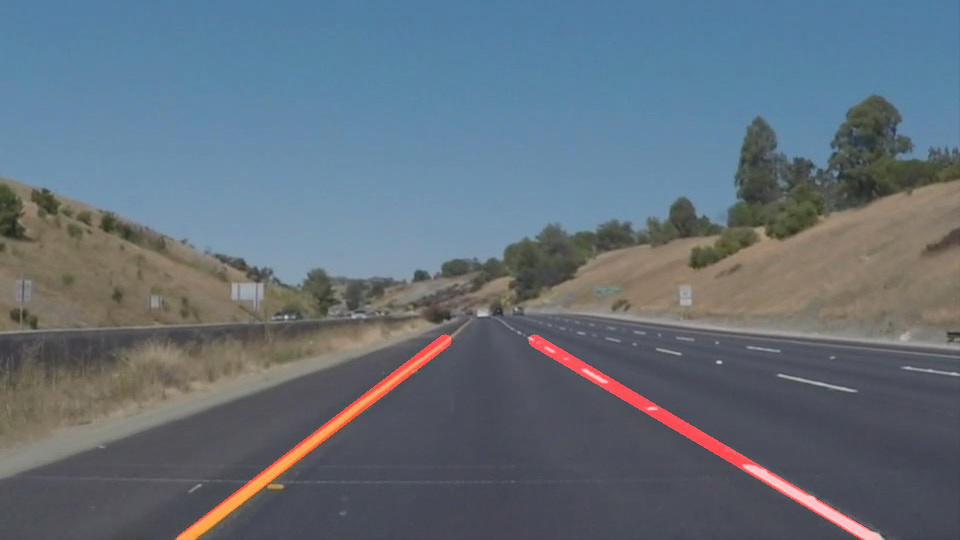

# Finding Lane Lines on the Road

## Overview

The goal of this project is to use OpenCV to identify
the lane lines on the road in some videos recorded by a camera
installed in front of a car. We build a pipeline for this purpose
and check its performance by applying to some images/videos.
Possible shortcomings and improvements are commented in the end.

## Reflection
In this project, we build a pipeline for identifying
left and right lane lines in images/videos captured by
a camera installed in front of a car. For this purpose,
we use some functions defined by using built-in functions of OpenCV.
For the size of the input image/video (in JPEG/MP4 format, color),
we mainly consider 960 x 540 (the exception is the Optional Challenge
part in which the original video provided is 1280x720).
The final output is the original image/video with the identified left and
right lanes overwritten. The output size is the same as the input one.
The detail of the analysis is given in the accompanied Jupyter Notebook
`P1.ipynb`. In this markdown, we provide the summary of it.

### 1. Pipeline for Lane Line Identification

#### Main Part
Our pipeline consists of the following steps
(these 6 steps are carried out inside the function `lane_finder()`):

1. Use `grayscale()` function to convert the input image to grayscale.
2. Use `gaussian_blur()` function to apply Gaussian blur to the grayscale image.
3. Use `canny()` function to apply the Canny transformation to the grayscale image.
4. Use `region_of_interest()` function to extract the region to focus on for
identifying the lane lines in the Canny transformed image.
5. Use `hough_lines()` function to apply the Hough transformation to the extracted
region for generating the lane line image. Inside this function, after
the Hough transformation, `draw_lines()` function
is called. This function draws two lines, one for the left lane and another
for the right one, by processing the line segments identified
by using the Hough transformation.
We will explain the detail of `draw_lines()` below.
6. Use `weighted_img()` function to draw the identified lane lines on the original image.

For the detail of the choice of the parameters in these steps, please
refer to `P1.ipynb`. Examples of the images generated in the end of
and in the course of this pipeline are given below.

Some remarks are in order:

- For the region of interest in Step 4, we consider a trapezoid whose
mid-bottom part is removed partly (see the image below).  As we encounter
in the video for Optional Challenge, some lines irrelevant
to the lane lines can exist inside the lane.
These lines are, for example, stains, shade, boundary of road surfaces
with different qualities, the front part of the car itself etc.
To avoid detecting these, we removed a part of the mid-bottom of the trapezoid.
(If Optional Challenge is not considered, this removal is not needed and
a normal trapezoid works well.)  

- For most of the videos and images for this project, the size is
960 x 540. However, only for Optional Challenge, the size of the given video
is 1280x720. We thus generalized the functions in our pipeline such that
they are applicable to the images with size 960x540 as well as 1280x720.
The generalization is straightforward since the height-width ratio is the same.

#### Improvement of `draw_lines()` Function
The originally provided `draw_lines()` function draw the line segments
identified by using the Hough transformations one by one.
To draw just two lines corresponding to the left and right lanes lines by using
the information of the identified line segments,
we modified `draw_lines()`function as follows:

1. Depending on the value of the slope, we divide segments into two groups.
More concretely, line segments with negative (resp. positive) slopes are used for
identifying the left (resp. right) lane. On top of this, we have introduced the
lower bound on the absolute value of the slope. This is lower bound is introduced
to remove some irrelevant lines showing up inside the lane. We note that
the lane lines are very steep in images/videos.
2. We compute the average slope and average intercept over
the line segments in each group. Then we draw the line with the average slop
and average intercept for each group. This gives the left and right lane lines
identified through our pipeline.

#### Intermediate and Output Images
Here we provide an example of the output image as well as
the images generated in the middle of the processing through
the above pipelines (for more examples images and videos
with the identified lane lines,
please refer to the accompanied Jupyter Notebook `P1.ipynb`):

- Original image

 

- After Step 1 (Grayscale)

 

- After Step 2 (Gaussian blur)

 

- After Step 3 (Canny transformation)

 

- After Step 4 (Restriction to region of interest)

We note that thick white lines are the boundary of the region of interest
(not the detected line segments).
 
 

- After Step 5 and 6 (Hough transformation + Draw lines on original image)

In this image, the red lines are the identified lane lines.
 

Our pipeline indeed identifies the lane lines correctly.

### 2. (Potential) Shortcomings
Here we summarize some potential shortcomings of our pipeline:

-  To avoid detecting the irrelevant line segments inside the lane such as the boundary
of road surfaces with different qualities, we have introduced
a lower bound on the absolute value of the slopes in `draw_lines()`.
However, in the case when the irrelevant line segment inside the lane is very steep
(even parallel to the vertical axis), the bound does not help to remove
this irrelevant line segment.
- To avoid detecting the irrelevant line segments inside the lane,
we have also removed partly the mid-bottom part of the trapezoid used for detecting
the line segments in Step 4 of our pipeline. This removal makes the region
for identifying the lane lines narrow. For example, when the car is trying
to change lanes, the actual lane line will be located in the middle of
the image and thus our pipeline miss to identify it.
- When the actual lane line is a single long line, the identified line
with our pipeline is stable in time. On the other hand, when the actual lane line is
a dashed line, the identified lane line tends to vibrate a little bit.
- As can be seen in the video for Optional Challenge, the identified
lane line vibrates a little bit when the car goes from the dark-colored
road to the light-colored road.
- When other cars are very close (i.e. just in front of the camera),
the identification of the lane will be hard.
- When the lane is very wide, identification of the lane line is difficult since
our pipeline takes into account the view just in front of the car.
- In this pipeline, we assumed that the lane lines can be identified as
straight lines. However, due to the optical property of the camera,
the real straight lines can be recorded as curved lines.
This optical effect needs to be taken into account.

<!-- One potential shortcoming would be what would happen when ...

Another shortcoming could be ... -->

### 3. Possible Improvements

Taking into account the (potential) shortcomings described in the previous part,
here we comment on possible improvements of our pipeline.

- As mentioned above, an actual straight line can be recorded as a curved line
by a camera. This optical effect needs to be taken into account. Once the optical
property of the camera lens is understood, one can build a map which
transforms the recorded curved line back to the straight line (such that
the actual straight lines are recorded as straight lines). This helps
us to identify the lane lines as straight lines correctly.
- In our pipeline, we identified the lane lines by using the image at a given
time only. In most of cases, the location of the lane lines do not change
drastically during a short time period. It is therefore better to keep
the memory of the identified lane line location during a short time period
and use it to identify the lane later.
This will help to stabilize the lane line identification process and
reduce the small vibration of the identified lanes that we encountered with our pipeline.
- Usually the lane lines are thicker than stains on the road etc. To take into
account the thickness of the line (lower bound on the thickness of the line
segment when detecting it) will help to avoid detecting the irrelevant line segments.
- This is beyond the pipeline, but it will be useful if a camera is installed
on the roof of the car. The video recorded with it contains information in a
wider region and thus can be used as supplement
for detecting the lane lines (for example when another car is right in
front or when the lane is very wide.)
